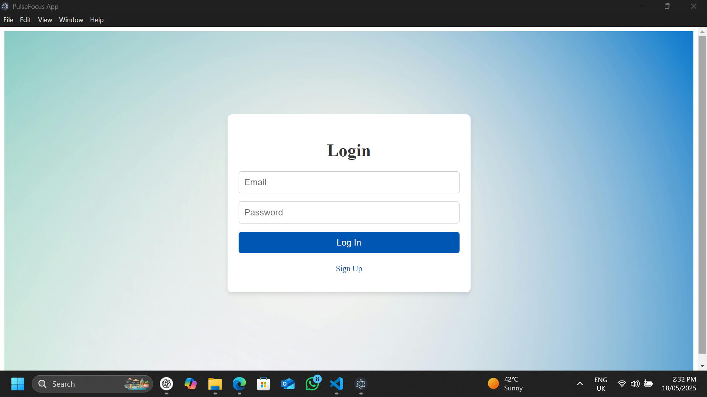
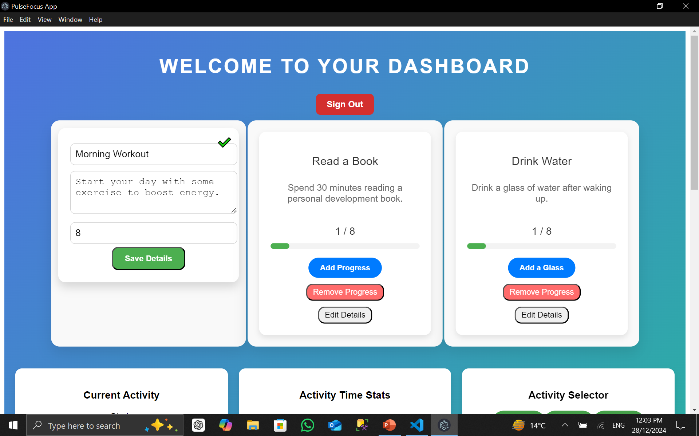
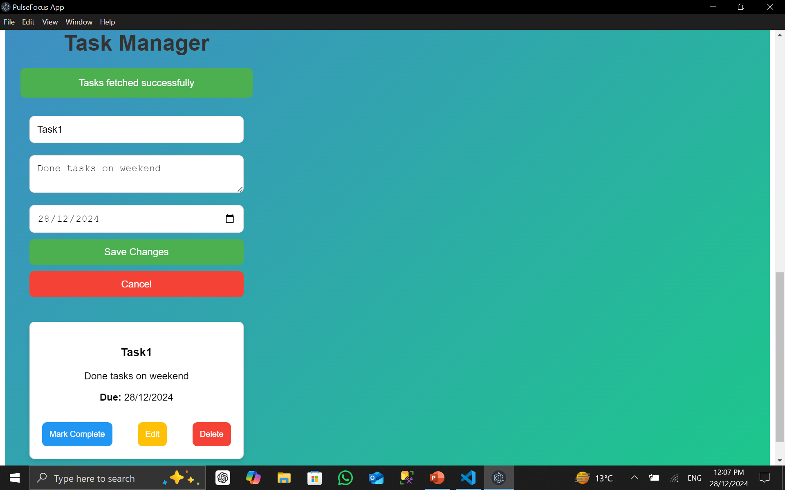

# PulseFocus: Personal Productivity Manager

PulseFocus is a cross-platform personal productivity manager built with React and Electron. It helps you organize tasks, track habits, and visualize your progress—all in a beautiful, modern desktop app.

## Preview

| Dashboard | Progress Chart | Task Manager |
|-----------|-------------|---------------|
|  |  |  |

## Features

- 📝 **Task Management:** Create, edit, and organize your daily tasks.
- 📈 **Progress Tracking:** Visualize your productivity with charts and graphs.
- 🔄 **Habit Tracker:** Build and maintain positive habits.
- 🔒 **User Authentication:** Secure login and registration.
- 💾 **Local Database:** Data stored locally using SQLite for privacy and speed.
- 🎨 **Modern UI:** Responsive, user-friendly interface with light/dark mode.

## Project Structure

```
personal-productivity-manager/
├── dist/                # Bundled app files
├── assets/              # Images, icons, fonts
├── public/              # Static files for React
├── src/
│   ├── backend/         # Electron main process, DB, services
│   └── frontend/        # React components, pages, hooks, utils
├── config/              # App configuration
├── package.json         # Project metadata and dependencies
├── electron-builder.json# Electron packaging config
├── webpack.config.js    # Webpack config
└── ...
```

## Getting Started

### 1. Install Dependencies

```bash
npm install
```

### 2. Start the Development Server

```bash
npm start           # Start React in development mode
npm run electron    # Launch Electron with the app
```

### 3. Package the App for Windows

```bash
npm run make        # Creates an installer for Windows
```

### 4. Publish to Microsoft Store

Use MSIX packaging (via tools like Electron Windows Store) to submit your app to the Microsoft Store.

## License

This project is licensed under the MIT License. See the [LICENSE](LICENSE) file for details.

---

**PulseFocus** — Your productivity, visualized and organized.
